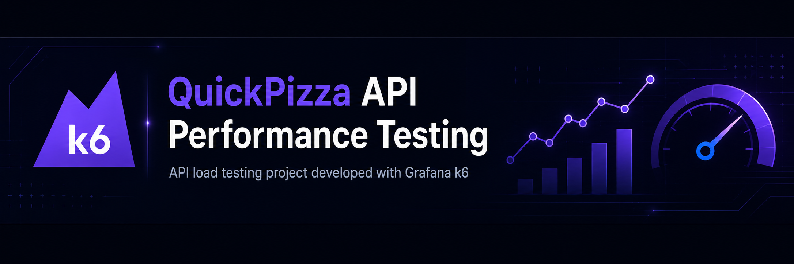

<p align="center">
  
</p>

<p align="center">
  <a href="https://github.com/evelyngrau/performance-k6-quickpizza/actions/workflows/k6-performance-test.yml">
    
  </a>
</p>

# QuickPizza API Performance Testing with Grafana k6

A compact API performance testing project created to practise workload modelling, functional validation, automated thresholds, result analysis, and professional reporting with **Grafana k6**.

## Overview

This project evaluates the reliability and response time of the public QuickPizza API under a small, progressively increasing workload.

The test was intentionally limited to a maximum of five virtual users because the target is a shared public demonstration environment.

## Project Summary

| Item | Detail |
|---|---|
| Tool | Grafana k6 |
| Language | JavaScript |
| Test type | Average load test |
| System under test | QuickPizza public demo |
| Endpoint | `GET /api/names` |
| Executor | `ramping-vus` |
| Maximum load | 5 virtual users |
| Configured duration | 1 minute 20 seconds |
| Report formats | PDF and self-contained HTML |

## Objectives

- Simulate concurrent API usage with virtual users.
- Apply a gradual ramp-up, steady-load, and ramp-down pattern.
- Validate the HTTP status, response format, and expected response structure.
- Measure response-time percentiles and request failure rate.
- Define automated performance acceptance criteria.
- Generate portable reports for technical and non-technical review.
- Document findings, limitations, and learning outcomes.

## Workload Model

The scenario uses the `ramping-vus` executor.

| Stage | Duration | Target VUs | Purpose |
|---|---:|---:|---|
| Ramp-up | 10 seconds | 2 | Introduce initial load |
| Increase | 30 seconds | 5 | Reach the target load |
| Steady load | 30 seconds | 5 | Observe stability |
| Ramp-down | 10 seconds | 0 | End the workload gradually |

Each virtual user:

1. Sends a request to `GET /api/names`.
2. Validates the response.
3. Waits for one second.
4. Repeats the iteration.

## Performance Acceptance Criteria

| Metric | Threshold |
|---|---:|
| HTTP request failure rate | `< 1%` |
| P95 response time | `< 1000 ms` |
| Successful checks | `> 99%` |

Thresholds work as automated quality gates. If one is breached, k6 returns a failed execution status.

## Baseline Performance Results

The first execution processed **235 HTTP requests**.

| Metric | Observed value | Evaluation |
|---|---:|---|
| HTTP request failure rate | `0.00%` | PASS |
| Average response time | `176.80 ms` | Informational |
| P95 response time | `199.96 ms` | PASS |
| Maximum response time | `249.95 ms` | Informational |
| Maximum virtual users | `5` | Expected |

The API met the response-time and HTTP error-rate criteria during this baseline execution.

## Validation Issue Identified

The initial response-body validation failed because the script assumed that the API returned an array at the root level.

Initial assumption:

```javascript
Array.isArray(responseBody)
```

Actual response structure:

```json
{
  "names": []
}
```

Corrected validation:

```javascript
Array.isArray(responseBody?.names) &&
responseBody.names.length > 0
```

This was a test-script issue rather than a performance defect in the API.

It reinforces an important testing principle: assertions must be based on the real API contract, and failed checks must be investigated before reporting a product defect.

## CI/CD Pipeline

The project includes a GitHub Actions workflow that executes the k6 test
automatically.

The workflow runs:

- Manually through `workflow_dispatch`.
- When performance test scripts are pushed to `main`.
- When a pull request modifies files inside the `tests` directory.

The pipeline:

1. Checks out the repository.
2. Installs Grafana k6.
3. Executes the QuickPizza performance test.
4. Evaluates the configured thresholds.
5. Generates an HTML report.
6. Uploads the report as a downloadable workflow artifact.

A threshold breach causes the workflow to fail, allowing the test to operate as
an automated performance quality gate.

### Downloading the CI Report

1. Open the repository's **Actions** tab.
2. Select a completed `k6 Performance Test` execution.
3. Scroll to the **Artifacts** section.
4. Download `quickpizza-k6-performance-report`.
5. Extract and open `k6-ci-report.html` in Chrome or Edge.


## Reports

### PDF report

The PDF version can be viewed directly in GitHub:

[View the full PDF performance report](reports/k6-performance-report.pdf)

### Interactive HTML report

GitHub stores HTML files but does not execute their embedded scripts inside a README or repository preview.

To use the interactive dashboard:

1. Open the file below.
2. Select **Download raw file**.
3. Open the downloaded file locally in Chrome or Edge.

[Open the interactive HTML report file](reports/k6-report.html)

## Project Structure

```text
performance-k6-quickpizza/
├── assets/
│   └── quickpizza-k6-banner.png
├── reports/
│   ├── k6-performance-report.pdf
│   └── k6-report.html
├── tests/
│   └── quickpizza-load-test.js
└── README.md
```

## Test Script

The performance test is located at:

```text
tests/quickpizza-load-test.js
```

The script includes:

- A `ramping-vus` workload.
- HTTP requests to the QuickPizza API.
- Functional checks.
- Performance thresholds.
- One-second think time between iterations.
- Tags for clearer request identification.

## Commands Used

### Verify the k6 installation

```powershell
k6 version
```

### Run the test

```powershell
k6 run .\tests\quickpizza-load-test.js
```

### Run the test with the local web dashboard

```powershell
$env:K6_WEB_DASHBOARD="true"
$env:K6_WEB_DASHBOARD_OPEN="true"

k6 run .\tests\quickpizza-load-test.js
```

The dashboard normally opens at:

```text
http://127.0.0.1:5665
```

### Generate the HTML report automatically

```powershell
$env:K6_WEB_DASHBOARD="true"
$env:K6_WEB_DASHBOARD_OPEN="true"
$env:K6_WEB_DASHBOARD_EXPORT="reports/k6-report.html"

k6 run .\tests\quickpizza-load-test.js
```

The report is generated at:

```text
reports/k6-report.html
```

## Git Commands Used

### Initialize the repository

```powershell
git init
```

### Add and commit the project

```powershell
git add .
git commit -m "Add k6 performance testing project"
```

### Connect the local project to GitHub

```powershell
git remote add origin https://github.com/evelyngrau/performance-k6-quickpizza.git
```

### Rename the branch and push it

```powershell
git branch -M main
git push -u origin main
```

### Upload later changes

```powershell
git add .
git commit -m "Update performance report and documentation"
git push
```

## Key Concepts Practised

### Virtual Users

Virtual users simulate concurrent users repeatedly executing the test function.

### Iterations

An iteration is one complete execution of the virtual-user workflow.

### Ramping Workload

The workload increases and decreases gradually instead of applying the maximum load immediately.

### Checks

Checks validate individual responses, including status code, content type, and response-body structure.

### Thresholds

Thresholds determine whether the complete test execution meets the defined acceptance criteria.

### Response-Time Percentiles

P95 represents the response time below which 95% of measured requests completed. It provides more useful context than the average alone.

### Error Rate

`http_req_failed` measures the proportion of HTTP requests considered unsuccessful by k6.

### Think Time

`sleep(1)` introduces a pause between iterations so each virtual user does not send requests continuously at maximum speed.

## Key Learnings

- Performance testing starts with a workload model and acceptance criteria, not with code.
- Functional validation remains necessary during performance testing.
- Checks and thresholds serve different purposes.
- Checks record individual validations.
- Thresholds determine the overall PASS or FAIL outcome.
- Assertions must match the real API contract.
- Percentiles provide more meaningful information than averages alone.
- Workload size should come from requirements, analytics, logs, or production traffic.
- Shared public environments require conservative load levels.
- A failed check does not automatically indicate a performance defect.
- Results must always be interpreted within the limitations of the environment.

## Limitations

- The target is a shared public demonstration environment.
- The test was executed from a local workstation.
- Internet latency may have influenced the observed response times.
- Server-side CPU, memory, database, and infrastructure metrics were unavailable.
- The workload was limited to five concurrent virtual users.
- The results do not represent production-scale capacity.

## Future Improvements

- Add separate smoke, spike, stress, and soak scenarios.
- Configure the base URL through environment variables.
- Test multiple endpoints as part of a realistic user journey.
- Add endpoint-specific thresholds with tags.
- Integrate the test into GitHub Actions.
- Store reports as workflow or release artifacts.
- Compare results across multiple executions.
- Correlate k6 metrics with server-side observability data.

## Author

**Evelyn Grau**

QA Engineer focused on manual testing, automation, API quality, performance testing, and AI-assisted QA workflows.